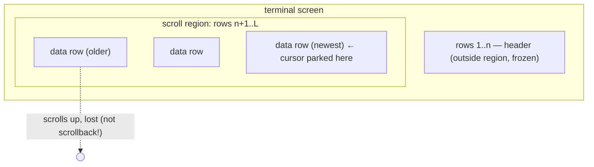
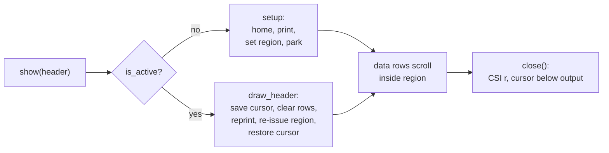

# Appendix: terminal — freezing the header with a DEC scroll region

## Why this tiny module exists

When metawtf runs in `human` format on a real terminal, the output is a
stream of aligned rows ticking past — and the header that labels the columns
would scroll away with them after the first screenful. That defeats the point
of aligned output: a table whose labels have left the building is just noise.
`metawtf/terminal.py` is the 70-line module that solves this the way
full-screen terminal programs have solved it since the VT100: it tells the
terminal to confine scrolling to the rows *below* the header, so the header
stays frozen at the top of the screen while data rows scroll underneath.

The module defines a single class, `PinnedHeader`, and knows nothing about
ROS, sampling, or columns. Its entire vocabulary is a handful of ANSI escape
sequences and a terminal size. That separation is deliberate: `sampler.py`
emits headers through one hook (`on_header`) and never learns whether the
hook prints plainly or manipulates the display, while this module never
learns what a header *means* — it is a string, a width, and a region.

## The theory: DECSTBM and confined scrolling

A naive terminal scrolls the whole screen: when text is printed past the
bottom row, every line moves up one and the top line falls into scrollback.
The DEC terminals (and every modern emulator descended from them — xterm,
gnome-terminal, iTerm2, tmux) offer an escape from this: **DECSTBM**, "Set
Top and Bottom Margins", issued as `CSI <top> ; <bottom> r`. After this
sequence, only the rows inside `[top, bottom]` participate in scrolling;
rows outside the region are glued to the glass.



So the trick is: print the header on rows 1..n, then declare the scroll
region to be rows n+1..L. Every subsequent `print` lands at the bottom of
the region and scrolls only within it. The header never moves because the
terminal itself was told it is not part of the scrollable surface. No
redrawing, no repainting, no per-tick escape traffic — the steady-state cost
of a frozen header is zero bytes.

There is one caveat that shapes the whole design, and the class docstring
states it plainly: **xterm-style terminals do not add lines scrolled off the
top of a scroll region to the scrollback buffer.** The region is treated as
a transient viewport, not as document history. That means human mode is
inherently lossy — once a row scrolls off, it is gone. The module's answer
is not to fight this but to route around it: when a full record matters, run
`format csv` redirected to a file, which has no terminal and therefore no
region and no loss. Two formats, two contracts: `human` optimizes for
watching, `csv` for keeping.

## The public shape: one hook, two paths

The sampler emits every header through a single callback. Column growth mid-
run (an hz `match` spec discovering a new topic, a json expander adding
columns) re-emits the header, so the pinned display must distinguish *first*
setup from *redraw*. `show` is that dispatcher:

```python
def show(self, header: str) -> None:
    # The sampler emits every header through one hook: the first sets the
    # pin up, later ones (column growth) redraw it in place.
    if self.is_active:
        self.draw_header(header)
    else:
        self.setup(header)
```

This is a two-state machine compressed into one boolean. `is_active` is the
only state the class keeps — it does not cache the header or the size,
because both can change between calls and re-deriving them is cheap.

The wiring lives in `tracer_node.py`, which also makes the policy decision
about *when* pinning is appropriate:

```python
self.pinned = (
    PinnedHeader() if is_human and sys.stdout.isatty() else None
)
```

Pinning is enabled only when the format is `human` *and* stdout is a real
terminal. `format human` forced into a pipe still gets the aligned text —
it just arrives unpinned, because escape sequences in a file or a pager
would be garbage. The `isatty()` guard is the whole "should we emit ANSI"
policy, and it lives at the construction site, not inside the class, so
`PinnedHeader` itself can be tested against a `StringIO` without pretending
to be a tty.

## Setup: home, print, declare, park

The first `show` call runs the one-time choreography:

```python
size = self.get_size()
rows = self.header_rows(header, size.columns)
top = min(rows + 1, size.lines)
self.write(
    f"{CSI}2J{CSI}1;1H{header}\n"
    f"{CSI}{top};{size.lines}r"
    f"{CSI}{size.lines};1H"
)
```

Five steps in one write. `CSI 2J` clears the whole screen first (F09): setup
pins the header onto the *current* screen, so without a clear the header prints
amid whatever the terminal already showed and is easy to miss — clearing gives
it a clean start at the top. `CSI 1;1H` then homes the cursor to the top-left so
the header lands on row 1 regardless of where the shell left the cursor. The
header is printed, followed by a newline so the cursor sits just under it.
Then `CSI top;Lr` declares the scroll region starting below the header.
Finally `CSI L;1H` parks the cursor on the *last* row — which is where
DECSTBM puts the cursor anyway on most emulators, but making it explicit
means the sampler's first `print` starts scrolling from the bottom of the
region immediately, rather than wasting the region's interior on a fill-up
pass.

Two details deserve attention:

- **`top` is clamped with `min(rows + 1, size.lines)`.** On a degenerate
  terminal shorter than the wrapped header, asking for a region that starts
  past the last row is either an error or undefined; clamping keeps the
  sequence well-formed (a zero-height region collapses to full-screen
  scrolling, which degrades gracefully to "no pinning" rather than breaking).
- **The whole setup is a single `write`.** Batching the sequences into one
  flushed write avoids a visible intermediate state (cursor homed but region
  not yet declared) on a live display.

## Redraw: why column growth is the hard case

Redrawing a frozen header in place is trickier than setting it up, because
the new header may be *wider* — and on a narrow terminal a wider header
*wraps to more rows*, which means the scroll region must move down to make
room. Worse, a stale copy of the old header may still occupy rows the new
region no longer covers. `draw_header` handles all of it in one atomic
sequence:

```python
size = self.get_size()
rows = self.header_rows(header, size.columns)
top = min(rows + 1, size.lines)
cleared = "".join(
    f"{CSI}{row};1H{CSI}2K" for row in range(1, rows + 1)
)
self.write(
    f"\0337{cleared}{CSI}1;1H{header}{CSI}{top};{size.lines}r\0338"
)
```

The bracketing sequences are **DECSC / DECRC** (`ESC 7` / `ESC 8`): save the
cursor, do all the header surgery, restore the cursor. This matters because
the cursor is parked at the bottom of the region mid-scroll; every cursor
move in between (clearing rows, homing, reprinting) is invisible to the data
stream because the restore puts the cursor back exactly where the next data
row expects it.

The surgery itself, in order:

1. **Clear** each of the `rows` header lines (`CSI row;1H` then `CSI 2K`,
   erase entire line). Clearing before reprinting erases leftovers when the
   new header's *content* on a given row is shorter than the old one's —
   otherwise characters from the previous, longer line would bleed through.
2. **Reprint** the new header from the home position.
3. **Re-issue the region** with the freshly computed `top`, so a header that
   grew to more wrapped rows pushes the region down — and a terminal the
   user resized gets a region that matches its new geometry.

Note that `get_size()` is called *fresh on every redraw*, never cached. That
one decision is what makes terminal resize work for free: a redraw after a
resize recomputes both the wrap count and the region bounds from the new
dimensions. The comment in the source calls out both triggers — column
growth and resize — because neither is obvious from the code's shape alone.

## Counting wrapped rows

Both setup and redraw depend on knowing how many screen rows the header
occupies, because the region must start *below* the last wrapped row or the
tail of the header scrolls away with the data:

```python
return max(1, -(-len(header) // max(1, columns)))
```

This is the classic ceiling-division idiom `-(-a // b)` — `ceil(a/b)`
expressed with floor division, avoiding a `math` import for one expression.
The two `max(1, ...)` guards handle the degenerate ends: an empty header
still occupies one row (the cursor is on it), and a zero-column terminal
report must not divide by zero. It is the kind of line that looks like
cleverness but is actually three defensive decisions packed into one return.



## Closing cleanly

Terminals are shared state: whatever region and cursor position a program
leaves behind, the shell inherits. `close` is the undo:

```python
if not self.is_active:
    return
self.is_active = False
height = self.get_size().lines
self.write(f"{CSI}r{CSI}{height};1H\n")
```

A bare `CSI r` (DECSTBM with no parameters) resets the region to the full
screen — the standard "clear the margins" form. Then the cursor is moved to
the last row and stepped past it with a newline, so the shell prompt lands
*below* all the pinned output rather than overwriting the last data row or
the header. The `is_active` guard makes `close` idempotent: `tracer_node.py`
calls it unconditionally in a `finally` after `KeyboardInterrupt`, and a
double close (or a close after a failed setup) must emit nothing. Clearing
the flag *before* writing rather than after is a quiet ordering choice —
if the write itself raised, the object still considers itself closed.

## Injecting the outside world

The class touches exactly two pieces of the environment — an output stream
and a terminal-size probe — and both are constructor parameters with
defaults:

```python
def __init__(self, out=None, get_size=None):
    self.out = out or sys.stdout
    self.get_size = get_size or shutil.get_terminal_size
    self.is_active = False
```

This is dependency injection at its most minimal: no framework, no
interfaces, just two callables defaulted at construction. The payoff is that
the entire escape-sequence logic — region math, wrap counting, clamping,
cursor bookkeeping — is testable against a `StringIO` and a lambda returning
a fake `terminal_size`, with no pty and no real terminal. `shutil.get_terminal_size`
is the right default probe because it honors the `COLUMNS`/`LINES`
environment variables when set and otherwise asks the tty itself via
`ioctl(TIOCGWINSZ)`, which is also why resizing works: each call re-reads
the kernel's current window size.

`write` is the single funnel for all output, and it flushes every time:

```python
def write(self, text: str) -> None:
    self.out.write(text)
    self.out.flush()
```

The flush is load-bearing, not hygiene. Escape sequences must take effect
*now* — a setup sequence sitting in a buffered pipe while data rows are
already being written would let rows scroll before the region exists. Since
the sampler prints through `print(..., file=self.out)` (which flushes on
newline only for line-buffered ttys, and not at all for fully-buffered
targets), keeping the flush inside this one method makes the guarantee
local and obvious.

## Design notes

- **One boolean of state.** The class deliberately caches nothing about the
  header or the terminal. Every decision is recomputed from the arguments
  and a fresh size probe, which is why resize and column growth both work
  without any change-detection logic. State you do not keep cannot go stale.
- **Zero steady-state cost.** After setup, data rows are plain `print`s with
  no escape sequences at all; the terminal does the freezing. Per-tick
  overhead exists only on header redraws, which are rare events (column
  growth), not per-sample work.
- **The caller owns the policy.** Whether to pin (`isatty`, format) and when
  to close (`finally` in `main`) live in `tracer_node.py`; this module owns
  only the mechanism. That mirrors the `Sampler.on_header` split from the
  other direction: each side of the hook has exactly one concern.
- **The scrollback caveat is documented, not solved.** The class could try
  to keep its own history, but that would duplicate what `format csv > file`
  already does perfectly. Naming the limitation in the docstring and pointing
  at the csv escape hatch is the honest engineering answer.

## Improvements and observations

- **No `SIGWINCH` handling.** Resize is handled lazily — the new geometry is
  picked up on the *next header redraw*, which only happens on column growth.
  If the columns never change, a resize can leave the region mismatched until
  the run ends. A `signal.signal(signal.SIGWINCH, ...)` handler that triggers
  a redraw (or a cheap periodic re-check in the tick loop) would close that
  gap; the lazy approach was presumably judged sufficient because redraws
  re-issue the region anyway.
- **Resize can strand old header rows.** If a narrower terminal makes the
  header wrap to *more* rows than before, `draw_header` clears only the new
  row count — which is correct — but if it wraps to *fewer* rows, the rows
  the old region used to cover are now inside the scroll region and carry
  stale header text until they scroll away. Harmless and self-healing, but
  visible for a moment.
- **`header_rows` assumes monospaced, non-ANSI headers.** The wrap estimate
  counts characters, which is exact for the sampler's padded ASCII headers
  but would be wrong for a header containing wide (CJK) characters or escape
  sequences. `wcwidth` would be the more correct measure if headers ever
  become non-ASCII.
- **Region bottom is always the last row.** DECSTBM supports an arbitrary
  bottom margin, which would allow a pinned *footer* (e.g. a status line
  showing pause state or sample rate) below the scroll region. The module's
  shape already generalizes — only `setup`/`draw_header` compute bounds —
  so a footer would be an additive feature, not a rewrite.
- **`close` writes to `out`, not stderr.** After a redirect is closed or
  during interpreter teardown, the trailing write can in principle fail;
  wrapping it in a contextlib.suppress-style guard would make shutdown
  bulletproof at the cost of hiding real write errors. The current
  idempotence guard already covers the common double-close case, so this is
  a marginal hardening, not a fix.
